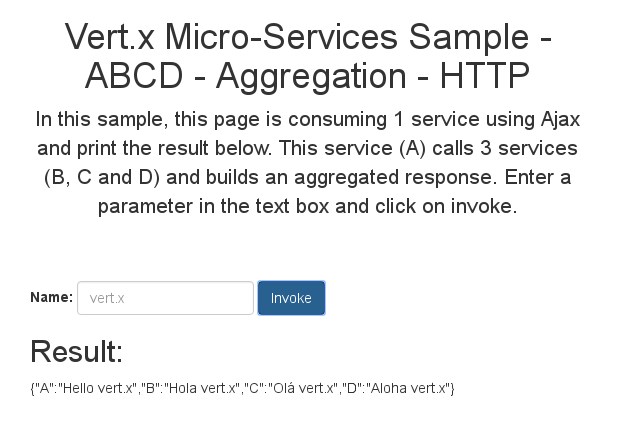
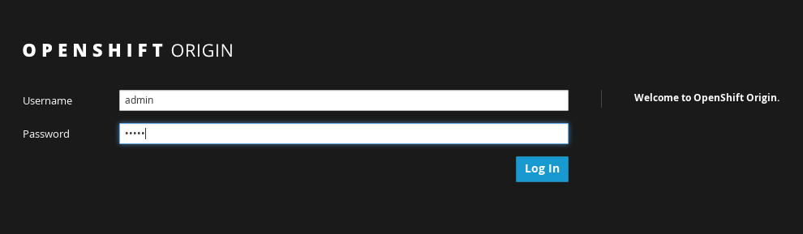
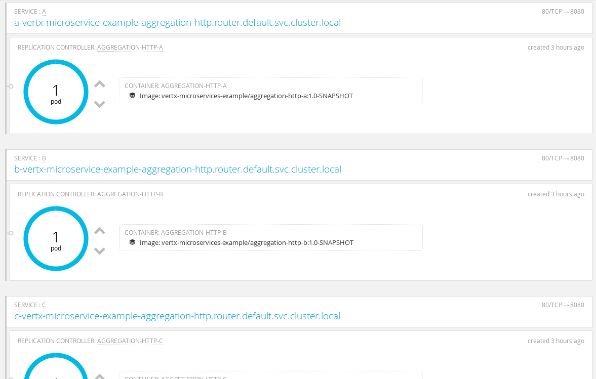
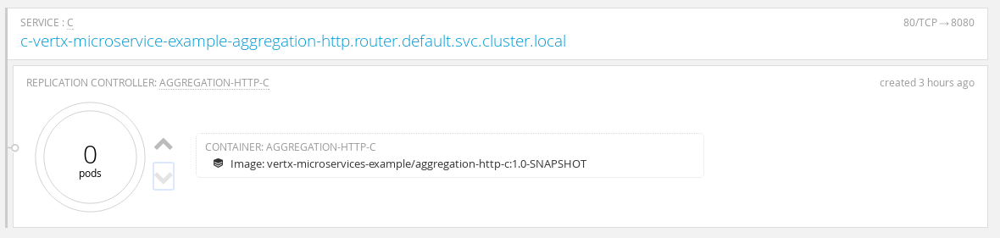

# Vert.x Microservices examples

This repository demonstrates how to build two common microservice patterns with vert.x:
 
1. aggregation
2. pipeline

It uses vert.x discovery, circuit breaker and if you run them on Openshift Origin, Kubernetes discovery.
 
In an aggregation, a microservice aggregates the results from other microservices. In this example, A calls B, C
 and D and returns the aggregated answer to the client.
  
In a pipeline, a microservice is calling another one, calling another one... In this example, A calls B, B calls C 
and C calls D. The client get the whole result.

In these examples, microservice communicates using HTTP. However this is not requires and you can use asynchronous 
service proxies, events, SOAP or whatever protocol you like.
  
## Run the demos locally
  
First, you need to build the projects, with:
  
```
mvn clean install
```

Be aware that the microservices are going to open the port: 8080 (A), 8081 (B), 8082 (C), and 8083 (D). This is 
configurable in the configuration files.
  
### Aggregation example
   
First go in the `aggregation-http` directory, and open 4 terminals (one for each microservice)

```
cd aggregation-http
```

Then, launch the microservices:

```
cd A
java -Djava.net.preferIPv4Stack=true -jar target/aggregation-http-A-1.0-SNAPSHOT-fat.jar -cluster -cp ../etc -conf src/main/config/config.json 
```

```
cd B
java -Djava.net.preferIPv4Stack=true -jar target/aggregation-http-B-1.0-SNAPSHOT-fat.jar -cluster -cp ../etc -conf src/main/config/config.json
```

```
cd C
java -Djava.net.preferIPv4Stack=true -jar target/aggregation-http-C-1.0-SNAPSHOT-fat.jar -cluster -cp ../etc -conf src/main/config/config.json
```

```
cd D
java -Djava.net.preferIPv4Stack=true -jar target/aggregation-http-D-1.0-SNAPSHOT-fat.jar -cluster -cp ../etc -conf src/main/config/config.json
```

Let's analyses these command lines:

* it uses IPv4 just to avoid some networking issues
* it launches the microservice (vert.x application) using the _fat jar_ build during the Maven build
* the vert.x application is started in cluster mode and get some configuration data

The cluster is using Hazelcast and is configured in the `../etc/cluster.xml` file. By default it uses `127.0.0.1`.
 
Once launch, open a browser to `http://localhost:8080/assets/index.html`. You should get a web page inviting you to 
submit a form that will execute the application:



If everything is launched, you should get: `{"A":"Hello vert.x","B":"Hola vert.x","C":"No service available (no 
record)","D":"Aloha vert.x"}`.

No shutdown one of the application (B, C or D), by hitting `CTRL+C` in the right terminal. Re-submit the form. You 
should get: `{"A":"Hello vert.x","B":"Hola vert.x","C":"No service available (no record)","D":"Aloha vert.x"}` or 
something similar.
 
When shutting down a microservice, it does not reply to the request anymore. The circuit breaker intercepts the error
 and execute a fallback. If you restarts it, the output should be back to _normal_. This is because the circuit 
 breaker tries periodically to reset its state and check whether or not things are back to _normal_.
         
         
### Pipeline example
   
First go in the `pipeline-http` directory, and open 4 terminals (one for each microservice)

```
cd pipeline-http
```

Then, launch the microservices:

```
cd A
java -Djava.net.preferIPv4Stack=true -jar target/pipeline-http-A-1.0-SNAPSHOT-fat.jar -cluster -cp ../etc -conf src/main/config/config.json 
```

```
cd B
java -Djava.net.preferIPv4Stack=true -jar target/pipeline-http-B-1.0-SNAPSHOT-fat.jar -cluster -cp ../etc -conf src/main/config/config.json
```

```
cd C
java -Djava.net.preferIPv4Stack=true -jar target/pipeline-http-C-1.0-SNAPSHOT-fat.jar -cluster -cp ../etc -conf src/main/config/config.json
```

```
cd D
java -Djava.net.preferIPv4Stack=true -jar target/pipeline-http-D-1.0-SNAPSHOT-fat.jar -cluster -cp ../etc -conf src/main/config/config.json
```

Let's analyses these command lines:

* it uses IPv4 just to avoid some networking issues
* it launches the microservice (vert.x application) using the _fat jar_ build during the Maven build
* the vert.x application is started in cluster mode and get some configuration data
         
The cluster is using Hazelcast and is configured in the `../etc/cluster.xml` file. By default it uses `127.0.0.1`.
 
Once launch, open a browser to `http://localhost:8080/assets/index.html`. You should get a web page inviting you to 
submit a form that will execute the application:


If everything is launched, you should get: `{"D":"Aloha vert.x","C":"Olá vert.x","B":"Hola vert.x","A":"Hello vert.x"}`.

No shutdown one of the application (B, C or D), by hitting `CTRL+C` in the right terminal. Re-submit the form. You 
should get: `{"C":"No service available (fallback)","B":"Hola vert.x","A":"Hello vert.x"}` or 
something similar.
 
When shutting down a microservice, it does not reply to the request anymore. The circuit breaker intercepts the error
 and execute a fallback. If you restarts it, the output should be back to _normal_. This is because the circuit 
 breaker tries periodically to reset its state and check whether or not things are back to _normal_.         

## Run the demos in Openshift Origin (v3)

These demos can also be executed in Openshift.

### Prerequisites

You will need to have Openshift on your machine to run them demo.

Here is how to start Openshift using Docker on Linux: 

```
docker rm origin
sudo docker run -d --name "origin" \
        --privileged --pid=host --net=host \
        -v /:/rootfs:ro -v /var/run:/var/run:rw -v /sys:/sys -v /var/lib/docker:/var/lib/docker:rw \
        -v /var/lib/origin/openshift.local.volumes:/var/lib/origin/openshift.local.volumes \
        openshift/origin start
docker logs -f origin
```

You would need the `oc` command line tool too. Download it form the Openshift web site.

### Login to openshift

Once launched, execute:

```
oc login
# credentials are admin / admin
```

Also connect with your browser on https://0.0.0.0:8443. The certificates are not valid, just force the access. You 
should arrive on a page similar to that one:



### Aggregation example


**Step 1: Project creation**

You first need to create the Openshift project, and give some permissions:

```
oc new-project vertx-microservice-example-aggregation-http
oc policy add-role-to-user admin admin -n vertx-microservice-example-aggregation-http
oc policy add-role-to-group view system:serviceaccounts -n vertx-microservice-example-aggregation-http
```

Do **not** change the project name, the configuration of the application is made for this name. See details below.

**Runs the microservice**

First go in the `aggregation-http` directory. Then for each project (A, B, C and D) runs:

```
mvn clean package docker:build fabric8:json fabric8:apply -Popenshift
```

It uses the Docker Maven plugin and the Fabric8 Maven plugin to build a docker image containing the microservice. It 
pushes it to the docker registry and creates the application in Openshift (using Kubernetes).
 
When you have deployed all components, you should have 4 pods in openshift, one for each service:
 


To access the application page, you need to get the IP of the service `A`. To get this IP, click on the service `A` 
and get the IP in the right side panel:


Once you have the IP, open the page: http://$ip/assets/index.html

You can use the application as the _local_ version. Then, go back to the Openshift overview page and scale down one 
of the service pod (B, C or D):



Try to reuse the application, the circuit breaker should detect the failure and use a fallback. If you restore the 
destroyed pod, the application should act _normally_ again.

**Kubernetes and service discovery**

When running in Openshift, the Kubernetes services are imported in the vert.x discovery service, so they are 
retrieved as _regular_ services by the application. 

### Pipeline example

**Step 1: Project creation**

You first need to create the Openshift project, and give some permissions:

```
oc new-project vertx-microservice-example-pipeline-http
oc policy add-role-to-user admin admin -n vertx-microservice-example-pipeline-http
oc policy add-role-to-group view system:serviceaccounts -n vertx-microservice-example-pipeline-http
```

Do **not** change the project name, the configuration of the application is made for this name. See details below.

**Runs the microservice**

First go in the `pipeline-http` directory. Then for each project (A, B, C and D) runs:

```
mvn clean package docker:build fabric8:json fabric8:apply -Popenshift
```

It uses the Docker Maven plugin and the Fabric8 Maven plugin to build a docker image containing the microservice. It 
pushes it to the docker registry and creates the application in Openshift (using Kubernetes).
 
When you have deployed all components, you should have 4 pods in openshift, one for each service:
 


To access the application page, you need to get the IP of the service `A`. To get this IP, click on the service `A` 
and get the IP in the right side panel:


Once you have the IP, open the page: http://$ip/assets/index.html

You can use the application as the _local_ version. Then, go back to the Openshift overview page and scale down one 
of the service pod (B, C or D):


Try to reuse the application, the circuit breaker should detect the failure and use a fallback. If you restore the 
destroyed pod, the application should act _normally_ again.


### Trick to shutdown everything

To shutdown openshift and the deployed pods use:

```
# On bash
docker stop `docker ps -qa`
docker rm -f `docker ps -qa` 
# Fish
docker stop (docker ps -qa)
docker rm -f (docker ps -qa)
```
