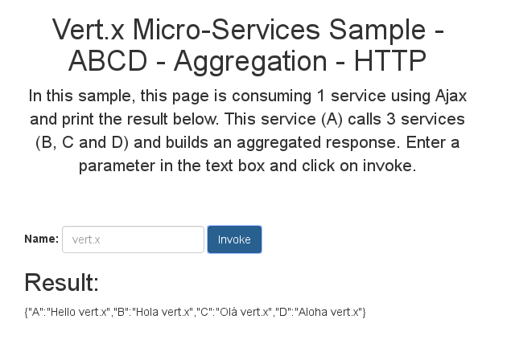
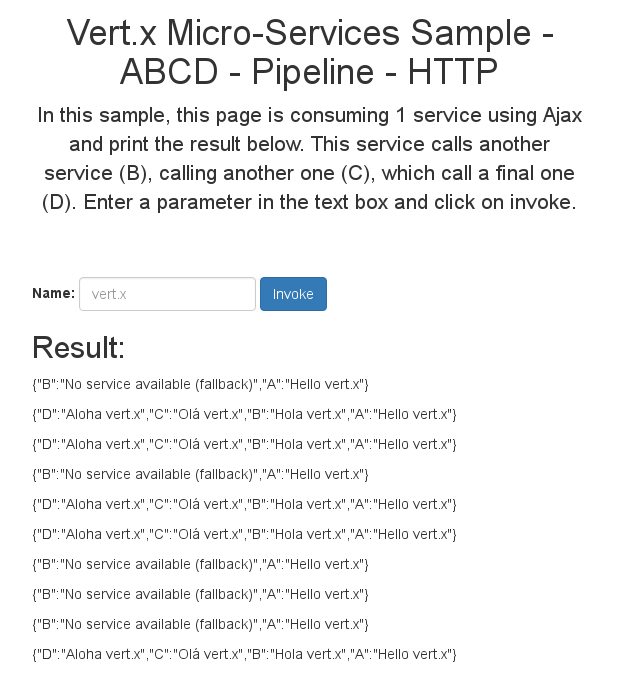
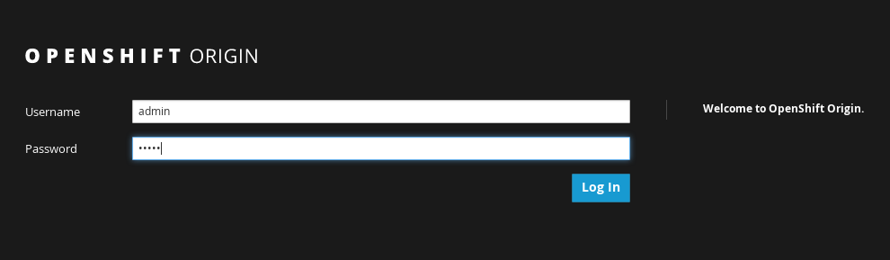
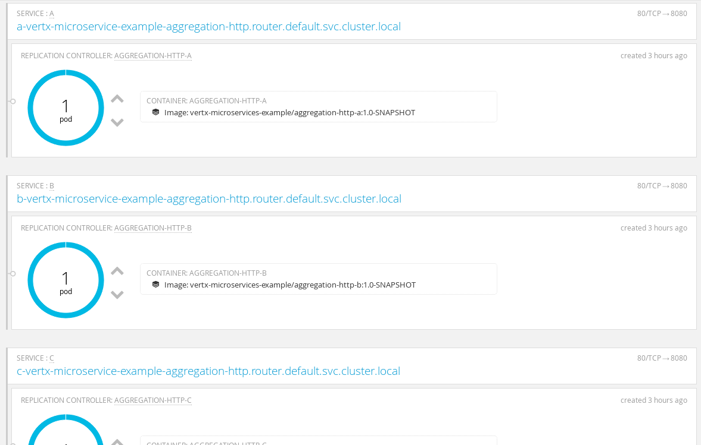
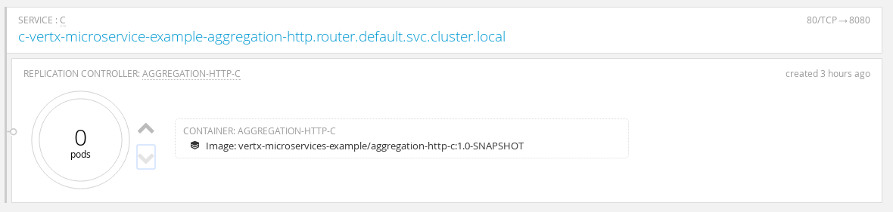

# Vert.x 마이크로서비스 예제

이번 예제에서는 vert.x로 자주 쓰이는 2개의 마이크로서비스 패턴을 구현해 볼 것 입니다.

1. aggregation
2. 파이프라인

만약에 Openshift Origin과 Kubernetes discovery 위에서 예제 서비스를 구동한다면, vert.x discovery, circuit breaker를 사용하게 됩니다.


aggreagation 패턴에서 마이크로서비스는 다른 마이크로서비스로부터 온 결과들을 모읍니다. 예를 들어 A는 B, C, D를 호출하고 클라이언트에게 합쳐진 결과를 보냅니다.

파이프라인 패턴에서는 마이크로서비스가 다른 서비스를 호출하고, 그 서비스가 또 다른 서비스를 호출합니다. 예를 들어 A가 B를 호출하고, B가 C를 호출하고,
C가 D를 호출하고 나면, 클라이언트는 그 결과를 전부 얻습니다.  

이번 예제에서는 마이크로서비스가 HTTP 프로토콜을 이용해 통신을 합니다. 그러나 이것은 필수사항이 아니고, 비동기 서비스 프록시, 이벤트 , SOAP와 같은
어떠한 프로토콜을 사용해도 상관이 없습니다.

## 로컬에서 데모를 실행해봅시다.

우선, 당신은 다음과 같은 명령어로 프로젝트를 빌드해야 합니다.:

```
mvn clean install
```

마이크로서비스는 8080 (A), 8081(B), 8082(C), 8083(D)의 각각 포트가 열려있어야만 한다는 점을 주의하세요! 이것은 설정파일에서 설정이 가능합니다.

### Aggregation 예제

우선 `aggregation-http` 디렉토리로 이동하세요, 그리고 4개의 터미널을 여세요.(각각의 터미널이 한개의 마이크로 서비스에 해당합니다.)

```
cd aggregation-http
```

그리고나서, 마이크로서비스를 실행시키세요:

```
cd A
java -Djava.net.preferIPv4Stack=true -jar target/aggregation-http-A-1.0-SNAPSHOT-fat.jar -cluster -cp ../etc -conf src/main/config/config.json
```

```
cd B
java -Djava.net.preferIPv4Stack=true -jar target/aggregation-http-B-1.0-SNAPSHOT-fat.jar -cluster -cp ../etc -conf src/main/config/config.json
```

```
cd C
java -Djava.net.preferIPv4Stack=true -jar target/aggregation-http-C-1.0-SNAPSHOT-fat.jar -cluster -cp ../etc -conf src/main/config/config.json
```

```
cd D
java -Djava.net.preferIPv4Stack=true -jar target/aggregation-http-D-1.0-SNAPSHOT-fat.jar -cluster -cp ../etc -conf src/main/config/config.json
```

위의 명령어들을 분석해봅시다:

* 각 명령어의 첫번째 부분은 몇몇 문제점 때문에 IPv4 주소를 사용하는 것을 의미합니다.
* 각 명령어의 두번째 부분은 메이븐을 통해 만들어진 _fat jar_ 을 이용해서 마이크로서비스(vert.x로 구현된 서비스)를 실행시킵니다.
* 각 명령어의 세번째 부분은 vert.x 어플리케이션을 클러스터 모드로 실행시키고, 약간의 설정 정보를 가져옵니다.

클러스터는 Hazelcast를 사용하고 `../etc/cluster.xml` 파일에 설정정보가 있습니다. 기본적으로 `127.0.0.1` 주소를 사용합니다.

일단 실행되고 나면 브라우저를 열어서 `http://localhost:8080/assets/index.html` 로 접속하세요. 당신은 아마 폼을 제출하는 웹페이지를 보게 될 것입니다.
그리고 이 폼은 우리의 어플리케이션을 실행시킬 것 입니다.



모든 것이 제대로 실행되면 당신은 다음과 같은 데이터를 얻게 됩니다: `{"A":"Hello vert.x","B":"Hola vert.x","C":"No service available (no
record)","D":"Aloha vert.x"}`.

터미널에서 `CTRL+C`를 입력하여 B,C,D 중 하나의 서비스를 셧다운 시켜봅시다. 폼을 다시 제출해보세요.
당신은 아마 다음과 같은 데이터를 얻게 될 것입니다. `{"A":"Hello vert.x","B":"Hola vert.x","C":"No service available (no record)","D":"Aloha vert.x"}` 어떤 서비스를 종료시켰는지에 따라 조금 달라질 수는 있지만요.

마이크로서비스를 종료시키고 나면, 더 이상 요청에 응답하지 않습니다. circuit breaker가 에러를 가로챌 것이고, fallback 함수를 실행시킬 것입니다.(역주: fallback은 어떤 것이 고장이나 작동불능일 때 대체하는 것을 말합니다.) 만약 당신이 서비스를 재실행하면, 출력은 아마 _정상_ 으로 돌아갈 것 입니다. 이것은 circuit breaker가 주기적으로 상태를 초기하고 _정상_ 으로 돌아갔는지 확인하기 때문입니다.


### 파이프라인 예제

우선, `pipeline-http` 디렉토리로 이동하고, 4개의 터미널을 실행시키세요. (각각의 터미널은 각각의 마이크로서비스를 의미합니다.)

```
cd pipeline-http
```

그리고 마이크로서비스를 실행시키세요:

```
cd A
java -Djava.net.preferIPv4Stack=true -jar target/pipeline-http-A-1.0-SNAPSHOT-fat.jar -cluster -cp ../etc -conf src/main/config/config.json
```

```
cd B
java -Djava.net.preferIPv4Stack=true -jar target/pipeline-http-B-1.0-SNAPSHOT-fat.jar -cluster -cp ../etc -conf src/main/config/config.json
```

```
cd C
java -Djava.net.preferIPv4Stack=true -jar target/pipeline-http-C-1.0-SNAPSHOT-fat.jar -cluster -cp ../etc -conf src/main/config/config.json
```

```
cd D
java -Djava.net.preferIPv4Stack=true -jar target/pipeline-http-D-1.0-SNAPSHOT-fat.jar -cluster -cp ../etc -conf src/main/config/config.json
```

위의 명령어를 분석해봅시다:

* 각 명령어의 첫번째 부분은 몇몇 문제점 때문에 IPv4 주소를 사용하는 것을 의미합니다.
* 각 명령어의 두번째 부분은 메이븐을 통해 만들어진 _fat jar_ 을 이용해서 마이크로서비스(vert.x로 구현된 서비스)를 실행시킵니다.
* 각 명령어의 세번째 부분은 vert.x 어플리케이션을 클러스터 모드로 실행시키고, 약간의 설정 정보를 가져옵니다.

클러스터는 Hazelcast를 사용하고 `../etc/cluster.xml` 파일에 설정정보가 있습니다. 기본적으로 `127.0.0.1` 주소를 사용합니다.

일단 실행되고 나면 브라우저를 열어서 `http://localhost:8080/assets/index.html` 접속하세요. 당신은 아마 폼을 제출하는 웹페이지를 보게 될 것입니다.
그리고 이 폼이 우리의 어플리케이션을 실행시킬 것 입니다.




모든 것이 제대로 실행되면 다음과 같은 데이터를 얻게 됩니다.: `{"D":"Aloha vert.x","C":"Olá vert.x","B":"Hola vert.x","A":"Hello vert.x"}`.

B,C,D 중 아무 서비스나 터미널에서 `CTRL+C`를 입력해서 종료시켜봅시다. 다시 폼을 제출하면 다음과 같은 데이터를 얻게 됩니다: `{"C":"No service available (fallback)","B":"Hola vert.x","A":"Hello vert.x"}` 어떤 서비스를 종료시켰는지에 따라 조금 달라질 수는 있지만요.

마이크로서비스를 종료시키고 나면, 더 이상 요청에 응답하지 않습니다. circuit breaker가 에러를 가로챌 것이고, fallback 함수를 실행시킬 것입니다.(역주: fallback은 어떤 것이 고장이나 작동불능일 때 대체하는 것을 말합니다.) 만약 당신이 서비스를 재실행하면, 출력은 아마 _정상_ 으로 돌아갈 것 입니다. 이것은 circuit breaker가 주기적으로 상태를 초기하고 _정상_ 으로 돌아갔는지 확인하기 때문입니다.         

## Openshift Origin (v3)에서 데모 구동하기

이 데모는 Openshift에서 구동할 수 있습니다..

### 요구사항

데모를 구동하기 위해서는 당신의 컴퓨터에 openshift가 설치되어 있어야 합니다.

리눅스 기반의 Docker를 이용해서 Openshift를 시작하는 방법은 다음과 같습니다:


```
docker rm origin
sudo docker run -d --name "origin" \
        --privileged --pid=host --net=host \
        -v /:/rootfs:ro -v /var/run:/var/run:rw -v /sys:/sys -v /var/lib/docker:/var/lib/docker:rw \
        -v /var/lib/origin/openshift.local.volumes:/var/lib/origin/openshift.local.volumes \
        openshift/origin start
docker logs -f origin
```

당신은 `oc`  명령어 툴도 필요합니다. Openshift 웹사이트에서 다운받을 수 있습니다.

### Openshift에 로그인 하기

구동이 되면 다음과 같은 명령어를 입력합니다.

```
oc login
# credentials are admin / admin
```

그리고 나서 웹브라우저로 https://0.0.0.0:8443 를 접속하세요. 인증서가 아마 올바르지 않다고 나오겠지만 무시하고 접속하세요. 아마 아래의 사진과 비슷한 페이지를 보게 될 것 입니다.



### Aggregation 예제


**Step 1: 프로젝트 생성**

우선 당신은 Openshift 프로젝트를 생성해야 하고, 권한도 부여해야 합니다:

```
oc new-project vertx-microservice-example-aggregation-http
oc policy add-role-to-user admin admin -n vertx-microservice-example-aggregation-http
oc policy add-role-to-group view system:serviceaccounts -n vertx-microservice-example-aggregation-http
```

**절대로** 프로젝트 이름을 바꾸지 마세요, 어플리케이션의 설정이 오직 이 프로젝트 이름에서만 작동되게 되어 있습니다. 더 자세한 것은 아래에 있습니다.

**마이크로서비스 구동**

우선 'aggregation-http' 디렉토리로 이동하세요. 그리고 각각의 프로젝트 (A, B, C, D)를 실행시키세요:

```
mvn clean package docker:build fabric8:json fabric8:apply -Popenshift
```

마이크로서비스를 포함하고 있는 Docker 이미지를 생성하기 위해 Docker Maven 플러그인과 the Fabric8 Maven 플러그인을 사용하고 있습니다.
이것은 Docker registry에 보내질 것이고, Openshift 어플리케이션을 생성할 것 입니다.(Kubernetes를 사용하는..)

만약 당신의 모든 컴포넌트들을 배포했다면, 당신은 아마 4개의 openshift pod를 가지고 있을 것 입니다. 각각은 하나의 서비스입니다:



어플리케이션 페이지에 접속하기 위해선 당신은 `A`의 아이피 주소를 알아야 합니다. 이 아이피를 알아내기 위해선 `A`를 클릭하고 오른쪽 패널에서 IP를 알아내세요.


아이피를 알아내면 다음의 페이지를 여세요: http://$아이피/assets/index.html

여러분은 _로컬 실행모드_ 와 동일하게 어플리케이션을 사용할 수 있습니다. 그리고 다시 Openshift overview 페이지로 넘어가서 B, C, D의 서비스 pod를 스케일-다운 시키세요:



어플리케이션을 재 사용하기 위해서, circuit breaker는 아마 실패를 감지하고 fallback를 사용 할 것 입니다. 만약에 없애버린 pod를 복구하면
다시 어플리케이션은 _정상_ 상태로 돌아옵니다.

**Kubernetes 와 service discovery**

Openshift에서 구동할 때, Kubernetes 서비스가 vert.x 의 discovery 서비스에 임포트 됩니다. 그래서 이들은 어플리케이션의 _정규_ 서비스로 다루어집니다.

### 파이프라인 예제

**Step 1: 프로젝트 생성**

우선 당신은 Openshift 프로젝트를 생성해야 하고, 권한도 부여해야 합니다:

```
oc new-project vertx-microservice-example-pipeline-http
oc policy add-role-to-user admin admin -n vertx-microservice-example-pipeline-http
oc policy add-role-to-group view system:serviceaccounts -n vertx-microservice-example-pipeline-http
```

**절대로** 프로젝트 이름을 바꾸지 마세요, 어플리케이션의 설정이 오직 이 프로젝트 이름에서만 작동되게 되어 있습니다. 더 자세한 것은 아래에 있습니다.

**마이크로서비스 구동**

우선 `pipeline-http` 디렉토리로 이동하세요. 그리고 A, B, C, D 각각의 프로젝트를 구동시키세요.

```
mvn clean package docker:build fabric8:json fabric8:apply -Popenshift
```

마이크로서비스를 포함하고 있는 Docker 이미지를 생성하기 위해 Docker Maven 플러그인과 the Fabric8 Maven 플러그인을 사용하고 있습니다.
이것은 Docker registry에 보내질 것이고, Openshift 어플리케이션을 생성할 것 입니다.(Kubernetes를 사용하는..)

만약 당신의 모든 컴포넌트들을 배포했다면, 당신은 아마 4개의 openshift pod를 가지고 있을 것 입니다. 각각은 하나의 서비스입니다:


어플리케이션 페이지에 접속하기 위해선 당신은 `A`의 아이피 주소를 알아야 합니다. 이 아이피를 알아내기 위해선 `A`를 클릭하고 오른쪽 패널에서 IP를 알아내세요.


아이피를 알아내면 다음의 페이지를 여세요: http://$아이피/assets/index.html

여러분은 _로컬 실행모드_ 와 동일하게 어플리케이션을 사용할 수 있습니다. 그리고 다시 Openshift overview 페이지로 넘어가서 B, C, D의 서비스 pod를 스케일-다운 시키세요:


어플리케이션을 재 사용하기 위해서, circuit breaker는 아마 실패를 감지하고 fallback를 사용 할 것 입니다. 만약에 없애버린 pod를 복구하면
다시 어플리케이션은 _정상_ 상태로 돌아옵니다.


### 모든 서비스를 한번에 셧다운 시키는 방법

Openshift 와 배포된 pods들을 종료시키기 위해선 다음의 명령어를 입력하세요:

```
# On bash
docker stop `docker ps -qa`
docker rm -f `docker ps -qa`
# Fish
docker stop (docker ps -qa)
docker rm -f (docker ps -qa)
```
